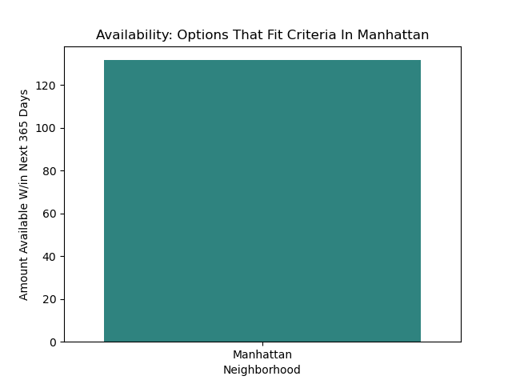

# Project - Airbnb Analysis

## Problem

Family of 4 outsourced Aj to help make a data-backed decision on a rental in NYC. Family wants to be close to kid-friendly activities like Central Park, Lego store, etc. Needs private room, highly rated location (including safety), lenient cancellation policy. Budget-friendly with a budget of $800 per night. Wishes to go sometime in the next year.

## Data Dictionary

Definitions for each value set in the data:

| **Field**                       | **Type** | **Description**                                                                                                                    |
|---------------------------------|----------|------------------------------------------------------------------------------------------------------------------------------------|
| id                              | integer  | Airbnb's unique identifier for the listing                                                                                         |
| NAME                            | text     | Name of the listing                                                                                                                |
| host_id                         | integer  | Airbnb's unique identifier for the host/user                                                                                       |
| host_name                       | text     | Name of the host (usually the first name)                                                                                          |
| host_identity_verified          | boolean  | Indicates whether the host's identity has been verified (True/False)                                                               |
| neighbourhood                   | text     | Neighborhood of the listing                                                                                                        |
| neighbourhood_group             | text     | The neighborhood group                                                                                                             |
| lat                             | numeric  | Latitude using the World Geodetic System (WGS84) projection                                                                        |
| long                            | numeric  | Longitude using the World Geodetic System (WGS84) projection                                                                       |
| room_type                       | text     | Type of room: Entire home/apt; Private room; Shared room; Hotel                                                                    |
| accommodates                    | integer  | The maximum capacity of the listing                                                                                                |
| price                           | currency | Daily price in local currency                                                                                                      |
| minimum_nights                  | integer  | Minimum number of nights required for a stay (calendar rules may be different)                                                     |
| availability 365                | integer  | Availability of the listing in the next 365 days, considering bookings and host blockages                                          |
| number_of_reviews               | integer  | The total number of reviews the listing has received                                                                               |
| license                         | text     | The license/permit/registration number for the listing                                                                             |
| instant_bookable                | boolean  | Indicates whether the guest can automatically book the listing without host approval (True/False)                                  |
| calculated_host_listings_count  | integer  | The number of listings the host has in the city                                                                                    |
| reviews_per_month               | numeric  | The average number of reviews the listing receives per month over its lifetime                                                     |
| review_rate_number              | numeric  | The average review rating for the listing, rounded to the nearest whole number                                          

## Executive Summary

The family of four was searching for a property close to kid-friendly activities, with a private room, highly rated location, lenient cancellation policy, and a budget of $800 per night. 
After analyzing the data, it was determined that both Manhattan and Brooklyn offer similar pricing, but Brooklyn has a greater selection of properties with private rooms. 
Verified host identity had minimal impact on review rates. 
Over 120 suitable options were available in both areas. 
Considering the desired proximity to attractions like Central Park and the Lego store, Manhattan was recommended as the more ideal location. 
By filtering for high review rates, private rooms, prices under $800, flexible cancellation policies, and focusing on Manhattan, a list of suitable options was generated. 
This data-driven approach provides the family with the necessary information to make an informed decision, considering their preferences and requirements for a stay in New York City.

### Data Cleaning Steps

The steps taken to reveiw and clean the data are as follows:
- Checked the first 5 rows to see what my data looked like.
- Checked # of rows and # of columns to see how big the data set was.
- Inspected the data types of the columns to see which columns were integers vs objects, etc.
- Checked for any null values.
- Checked describe to see counts, means, mins, maxs, etc. of each numerical column.
- Checked describe "include 'O'" to see top, freq, unique, etc. for each text column.
- Reviewed the outputs for all of the above to determine some columns have object data types when they should be integers, currency was not standardized showing $ some places and not others, some columns were not descriptive enough to be easily understood, and there were some negative numbers in places where it didn't make sense for there to be a negative (ex: min amount of nights).
- First, I renamed the columns for readability, to make them more easily understood as to what the data is showing.
- Then, I made the negative values null to not account for them in the reporting. This way we ensure accuracy in the data and visualizations.
- Next, I changed the data types to date/time and integers where needed.
- Finally, I examined value counts and saw that there were values listed in manhatan and broklyn outside of the values in Manhattan and Brooklyn. I used replace to consolidate those values into the other columns with the correct spelling.

### Key Visualizations

Both Brooklyn & Manhattan have over 120 options available within the next year that fit the family's criteria.
Visual Depictions:

#### Visualization 1: [Manhattan: Available Options Within Family's Preferences]

#### Visualization 2: [Brooklyn: Available Options Within Family's Preferences]

## Conclusions/Recommendations

The top five recommendations in Manhattan, based on high review counts, are Property ID #50715, #67913, #2236, #4932, and #53229. 
These recommendations prioritize properties with the most reviews, ensuring accuracy and peace of mind for the family's decision.
After reviewing these 5, continue down the filtered recommendation list [Here](data/cleaned_data.csv)

## Additional Information

Next Steps: 

Research additional data with the following information:
- Bedroom Count
- Safety Rating

Perform further analysis based upon the additional data.